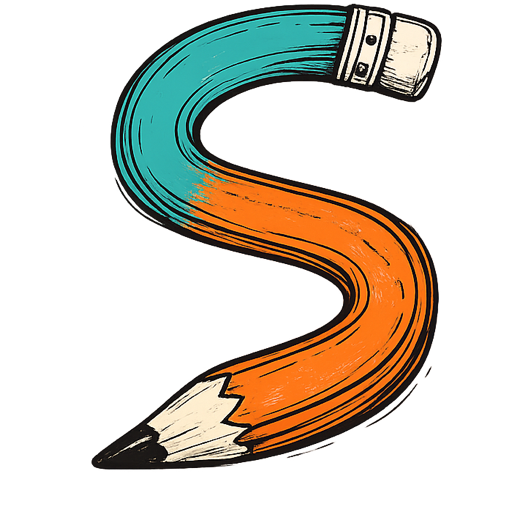

<p align="center">
  
</p>

<h1 align="center">Scrawl</h1>

<p align="center">
  <strong>A local-first canvas for technical diagrams and visual thinking.</strong>
  <br />
  Create precise vector diagrams or give the same document a hand-drawn character.
</p>

<p align="center">
  <a href="./LICENSE"></a>
  
  
  
</p>

<p align="center">
  <a href="#features">Features</a> ·
  <a href="#quick-start">Quick start</a> ·
  <a href="#documentation">Documentation</a> ·
  <a href="./CONTRIBUTING.md">Contributing</a>
</p>

Create flowcharts, system diagrams, wireframes, and visual notes in one focused workspace. Every
shape stays editable as you move between crisp geometry and a hand-drawn finish, while your work
remains local and portable in the open `.scrawl` format.

## Features

- **Diagram and draw:** rectangles, ellipses, diamonds, arrows, lines, freehand paths, text,
  notes, local images, and a searchable shape library.
- **Precise or hand-drawn:** switch rendering styles without changing the underlying geometry or
  document semantics.
- **Powerful editing:** resize, rotate, group, lock, align, distribute, reorder, duplicate, and
  multi-select objects.
- **Smart connections:** straight and elbow connectors with editable endpoints, vertices,
  segments, and stable shape anchors.
- **Organized documents:** multiple pages, layers, reusable local templates, command search,
  keyboard shortcuts, and undo/redo.
- **Local-first persistence:** IndexedDB autosave with a previous-save recovery copy.
- **Portable files:** open and save editable `.scrawl` documents, import common draw.io diagrams,
  and export SVG, PNG, or multi-page PDF.
- **Offline ready:** install Scrawl as a progressive web application and continue working without
  a network connection.

## Why Scrawl?

| Principle         | What it means                                                            |
| ----------------- | ------------------------------------------------------------------------ |
| Local first       | Your working document remains in your browser unless you export it.      |
| Open format       | `.scrawl` is a documented, versioned JSON format.                        |
| One source        | Precise and sketch rendering share the same editable scene.              |
| Safe interchange  | Imports are bounded and validated before replacing the current document. |
| No required cloud | The editor, autosave, import, export, and recovery work locally.         |

## Quick start

Scrawl requires Node.js 22 or newer and pnpm 10.

```bash
pnpm install
pnpm dev
```

Open [http://localhost:5173](http://localhost:5173). No environment variables or external services
are required.

## Quality checks

Install the browser used by the end-to-end suite once, then run the complete release gate:

```bash
pnpm exec playwright install chromium
pnpm release:check
```

Focused commands are available for faster development:

```bash
pnpm test
pnpm test:coverage
pnpm test:performance
pnpm test:e2e
```

The release gate covers formatting, linting, strict TypeScript, unit and integration tests,
coverage thresholds, production builds, browser workflows, accessibility, offline startup, and
performance budgets.

## Project structure

```text
apps/web              React application and browser interface
packages/editor       Editor state, commands, snapping, and document operations
packages/engine       Geometry, rendering, connectors, SVG, raster, and PDF output
packages/interchange  Safe draw.io import
packages/schema       Versioned Scrawl document model and validation
packages/storage      Local persistence, project files, recovery, and templates
tests/e2e             Critical browser and accessibility workflows
```

## Documentation

- [Architecture](./docs/architecture.md)
- [Scrawl document format](./docs/document-format.md)
- [Draw.io compatibility](./docs/drawio-compatibility.md)
- [Export and printing](./docs/export-and-print.md)
- [Keyboard shortcuts](./docs/keyboard-shortcuts.md)

## Contributing

Contributions are welcome. Start with [CONTRIBUTING.md](./CONTRIBUTING.md), follow the
[Code of Conduct](./CODE_OF_CONDUCT.md), and use the issue templates when reporting bugs or
proposing features.

For security vulnerabilities, follow the private reporting instructions in
[SECURITY.md](./SECURITY.md).

## License

Scrawl is available under the [MIT License](./LICENSE).
